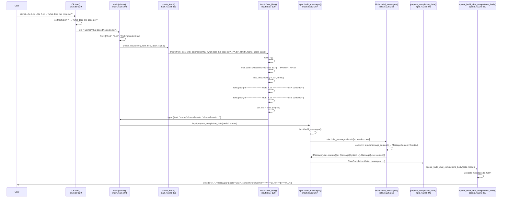

# CLI-to-Message Flow: Complete Execution Path

## Overview

This document traces the complete execution path from `aichat --file A.txt --file B.txt -- "what does this code do?"` through all code transformations to the final API request body.

## (a) Mermaid Sequence Diagram



## (b) Transformation Steps with File:Line References

### Step 1: CLI Argument Parsing
**File:** `src/cli.rs:81-129`

The `Cli` struct (line 7) uses `clap` to parse arguments:
- `--file` / `-f` → `pub file: Vec<String>` (line 56-57)
- Trailing positional args → `text: Vec<String>` (line 85-86, `trailing_var_arg = true`)

The `Cli::text()` method (lines 89-129):
```rust
// cli.rs:120-121
false => {
    let text = self.text.join(" ");  // joins all trailing args with space
    ...
    Ok(Some(text))
}
```

**Output:** `text = Some("what does this code do?")`, `file = vec!["A.txt", "B.txt"]`

---

### Step 2: Main Entry & Working Mode
**File:** `src/main.rs:35-42`

```rust
// main.rs:37
let text = cli.text()?;
// main.rs:40-43
} else if text.is_none() && cli.file.is_empty() {
    WorkingMode::Repl
} else {
    WorkingMode::Cmd  // ← our path, since text.is_some() OR file.is_non_empty()
};
```

---

### Step 3: Dispatch to `create_input()`
**File:** `src/main.rs:181`

```rust
// main.rs:181
let mut input = create_input(&config, text, &cli.file, abort_signal.clone()).await?;
```

---

### Step 4: `create_input()` Function
**File:** `src/main.rs:328-351`

```rust
// main.rs:328-351
async fn create_input(
    config: &GlobalConfig,
    text: Option<String>,
    file: &[String],
    abort_signal: AbortSignal,
) -> Result<Input> {
    let input = if file.is_empty() {
        Input::from_str(config, &text.unwrap_or_default(), None)
    } else {
        Input::from_files_with_spinner(
            config,
            &text.unwrap_or_default(),  // "what does this code do?"
            file.to_vec(),               // ["A.txt", "B.txt"]
            None,
            abort_signal,
        )
        .await?
    };
    ...
}
```

Since `file` is non-empty, it calls `Input::from_files_with_spinner()`.

---

### Step 5: `Input::from_files_with_spinner()` → `Input::from_files()`
**File:** `src/config/input.rs:126-137`

```rust
// input.rs:126-137
pub async fn from_files_with_spinner(...) -> Result<Self> {
    abortable_run_with_spinner(
        Input::from_files(config, raw_text, paths, role),
        "Loading files",
        abort_signal,
    )
    .await
}
```

This is just a wrapper that adds a loading spinner.

---

### Step 6: `Input::from_files()` — THE CRITICAL ASSEMBLY STEP
**File:** `src/config/input.rs:57-120`

```rust
// input.rs:57-120
pub async fn from_files(
    config: &GlobalConfig,
    raw_text: &str,          // "what does this code do?"
    paths: Vec<String>,      // ["A.txt", "B.txt"]
    role: Option<Role>,
) -> Result<Self> {
    ...
    let (documents, medias, data_urls) = load_documents(...).await?;

    let mut texts = vec![];                    // line 77
    if !raw_text.is_empty() {                  // line 78
        texts.push(raw_text.to_string());      // line 79 ← PROMPT PUSHED FIRST
    };
    ...
    let documents_len = documents.len();       // line 95
    for (kind, path, contents) in documents {  // line 96
        if documents_len == 1 && raw_text.is_empty() {
            texts.push(format!("\n{contents}"));
        } else {
            texts.push(format!(                // line 99-101
                "\n============ {kind}: {path} ============\n{contents}"
            ));
        }
    }
    ...
    Ok(Self {
        text: texts.join("\n"),                // line 105 ← FINAL ASSEMBLY
        ...
    })
}
```

**🚨 KEY FINDING:** The prompt text (`raw_text`) is pushed into `texts[]` FIRST (line 79), and file documents are appended AFTER (lines 96-103). This determines the final ordering.

---

### Step 7: `Input::text()` Accessor
**File:** `src/config/input.rs:153-157`

```rust
// input.rs:153-157
pub fn text(&self) -> String {
    match self.patched_text.clone() {
        Some(text) => text,   // used when RAG patches the text
        None => self.text.clone(),  // ← normal path: returns assembled text
    }
}
```

---

### Step 8: `Input::message_content()`
**File:** `src/config/input.rs:357-376`

```rust
// input.rs:357-376
pub fn message_content(&self) -> MessageContent {
    if self.medias.is_empty() {
        MessageContent::Text(self.text())  // ← text-only case (no images)
    } else {
        // multimodal case with images
        let mut list: Vec<MessageContentPart> = self.medias.iter()...collect();
        if !self.text.is_empty() {
            list.insert(0, MessageContentPart::Text { text: self.text() });
        }
        MessageContent::Array(list)
    }
}
```

For text files (no images), this wraps the assembled text in `MessageContent::Text`.

---

### Step 9: `Input::build_messages()`
**File:** `src/config/input.rs:252-267`

```rust
// input.rs:252-267
pub fn build_messages(&self) -> Result<Vec<Message>> {
    let mut messages = if let Some(session) = self.session(&self.config.read().session) {
        session.build_messages(self)   // session path
    } else {
        self.role().build_messages(self)  // role-only path (our default case)
    };
    if let Some(tool_calls) = &self.tool_calls {
        messages.push(Message::new(
            MessageRole::Assistant,
            MessageContent::ToolCalls(tool_calls.clone()),
        ))
    }
    Ok(messages)
}
```

---

### Step 10: `Role::build_messages()` (no session, default case)
**File:** `src/config/role.rs:225-258`

```rust
// role.rs:225-258
pub fn build_messages(&self, input: &Input) -> Vec<Message> {
    let mut content = input.message_content();  // MessageContent::Text("prompt\n\n===A===...")
    let mut messages = if self.is_empty_prompt() {
        // No role prompt → just the user message
        vec![Message::new(MessageRole::User, content)]
    } else if self.is_embedded_prompt() {
        // Role prompt with __INPUT__ placeholder
        content.merge_prompt(|v: &str| self.prompt.replace(INPUT_PLACEHOLDER, v));
        vec![Message::new(MessageRole::User, content)]
    } else {
        // Standard role prompt → System message + User message
        let mut messages = vec![];
        let (system, cases) = parse_structure_prompt(&self.prompt);
        if !system.is_empty() {
            messages.push(Message::new(MessageRole::System, MessageContent::Text(system.to_string())));
        }
        // optional few-shot examples...
        messages.push(Message::new(MessageRole::User, content));  // ← user message is LAST
        messages
    };
    ...
    messages
}
```

---

### Step 10b: `Session::build_messages()` (session case)
**File:** `src/config/session.rs:525-555`

```rust
// session.rs:525-555
pub fn build_messages(&self, input: &Input) -> Vec<Message> {
    let mut messages = self.messages.clone();  // existing conversation history
    ...
    let len = messages.len();
    if len == 0 {
        messages = input.role().build_messages(input);  // first message: use role
        need_add_msg = false;
    }
    ...
    if need_add_msg {
        messages.push(Message::new(MessageRole::User, input.message_content()));  // append user msg
    }
    messages
}
```

---

### Step 11: `prepare_completion_data()`
**File:** `src/config/input.rs:230-249`

```rust
// input.rs:230-249
pub fn prepare_completion_data(&self, model: &Model, stream: bool) -> Result<ChatCompletionsData> {
    let mut messages = self.build_messages()?;
    patch_messages(&mut messages, model);
    model.guard_max_input_tokens(&messages)?;
    let (temperature, top_p) = (self.role().temperature(), self.role().top_p());
    let functions = self.config.read().select_functions(self.role());
    Ok(ChatCompletionsData { messages, temperature, top_p, functions, stream })
}
```

---

### Step 12: `openai_build_chat_completions_body()`
**File:** `src/client/openai.rs:226-320`

```rust
// openai.rs:226-320
pub fn openai_build_chat_completions_body(data: ChatCompletionsData, model: &Model) -> Value {
    let ChatCompletionsData { messages, ... } = data;
    let messages: Vec<Value> = messages
        .into_iter()
        .enumerate()
        .flat_map(|(i, message)| {
            let Message { role, content } = message;
            match content {
                ...
                // For regular text/array messages:
                _ => vec![json!({ "role": role, "content": content })],
            }
        })
        .collect();

    let mut body = json!({
        "model": &model.real_name(),
        "messages": messages,
    });
    ...
}
```

The `MessageContent` enum derives `Serialize` with `#[serde(untagged)]` (message.rs:81):
- `MessageContent::Text(String)` → serializes as a plain JSON string
- `MessageContent::Array(Vec<MessageContentPart>)` → serializes as a JSON array

---

## (c) Exact Ordering of Content in the Final User Message

### For the command: `aichat --file A.txt --file B.txt -- "what does this code do?"`

The final user message `content` field in the API request body is:

```
what does this code do?
\n
============ FILE: A.txt ============
<entire contents of A.txt>
\n
============ FILE: B.txt ============
<entire contents of B.txt>
```

### Ordering breakdown:

| Position | Content | Source | Nature |
|----------|---------|--------|--------|
| 1st (TOP) | `"what does this code do?"` | `raw_text` parameter (from CLI trailing args) | **DYNAMIC** — changes every invocation |
| 2nd | `\n\n============ FILE: A.txt ============\n<contents>` | First file document | **STATIC** — same between calls |
| 3rd | `\n\n============ FILE: B.txt ============\n<contents>` | Second file document | **STATIC** — same between calls |

### Exact assembly logic (input.rs:77-105):

```rust
texts = vec![];
texts.push("what does this code do?");           // index 0: PROMPT
texts.push("\n============ FILE: A.txt ============\n<A contents>");  // index 1: FILE A
texts.push("\n============ FILE: B.txt ============\n<B contents>");  // index 2: FILE B
self.text = texts.join("\n");
// Result: "what does this code do?\n\n============ FILE: A.txt ============\n..."
```

### Final JSON API request body (e.g., for OpenAI):

```json
{
  "model": "gpt-4",
  "messages": [
    {
      "role": "system",
      "content": "<role prompt, if any>"
    },
    {
      "role": "user",
      "content": "what does this code do?\n\n============ FILE: A.txt ============\n<entire contents of A.txt>\n\n============ FILE: B.txt ============\n<entire contents of B.txt>"
    }
  ]
}
```

### Why this ordering is problematic for prefix caching:

LLM prefix caching (Anthropic, OpenAI, Google) works by caching from the **start** of the prompt. For cache hits, the **beginning** of the content must be identical between requests.

**Current ordering (bad for caching):**
```
[DYNAMIC prompt] → [STATIC file A] → [STATIC file B]
```
Every new question invalidates the entire cache because the first thing that changes is at position 0.

**Optimal ordering (good for caching):**
```
[STATIC file A] → [STATIC file B] → [DYNAMIC prompt]
```
The static file contents form a stable prefix. Only the tail (the prompt) changes between calls, preserving the cached prefix.

### Single point of change required:

The fix location is **`src/config/input.rs:77-79`** — moving the `texts.push(raw_text.to_string())` to AFTER the document loop (after line 103) would reverse the ordering to be cache-friendly.
